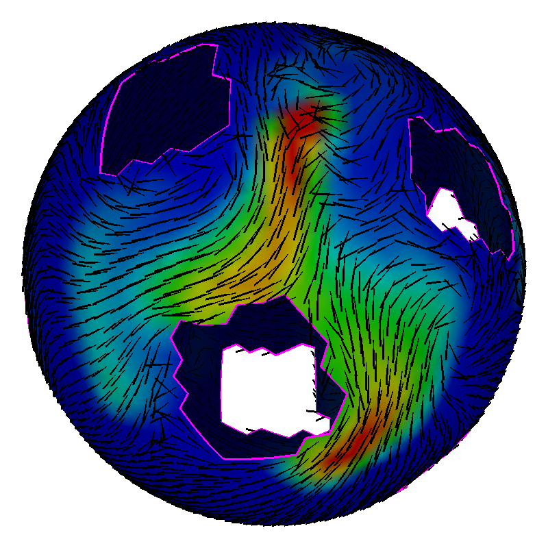
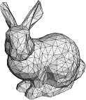
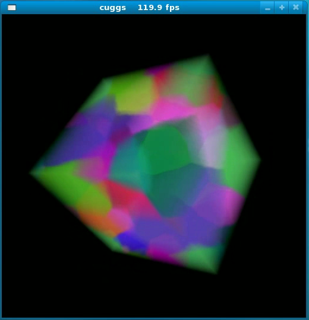
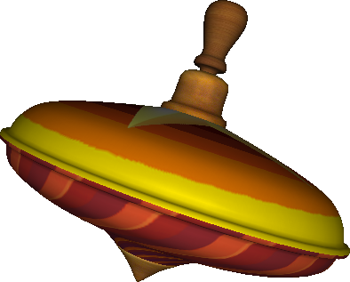
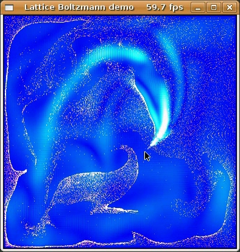
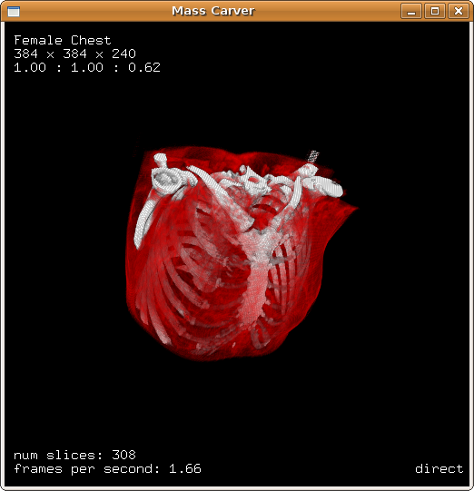
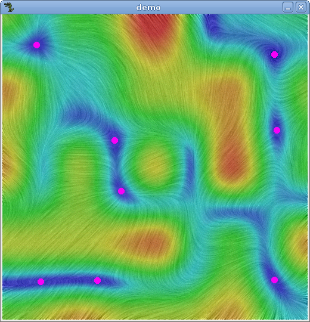
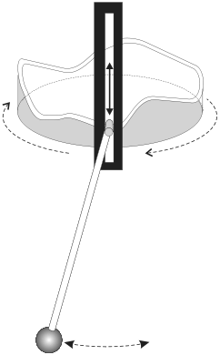

Personal CS Student Portfolio
=============================

by Torsten Stöter, 2011 Computer Science alumni of Otto von Guericke University Magdeburg, Germany

Welcome to this repository, where I archive and share my student projects centered on visualization and physical simulations. These projects were originally hosted on my former student website. Below, you’ll find a list of these projects, each located in a subdirectory of this repository.

### Fluid Simulation on Curved Triangle Mesh Surfaces
<table>
<tr>
<td width="15%">

</td>
<td>

Fluss implements my final thesis project &mdash; a simple geometric and physically-based method for simulating fluid flows on curved triangle mesh surfaces. Previous methods for simulating surface flows require parametrizations of the surface globally or locally flattening the surface. However, these parametrizations introduce distortions to the flow. The proposed method operates directly on the triangle mesh, geometrically computing the fluid flow for individual triangles and does not need a parametrization of the surface. The thesis further investigated the numerical and physical properties of the method and demonstrated its accuracy in resolving fluid flows.

Tech: C++, OpenMP, OpenGL, GLUT 
Links: <a href="surface-flow">Source Code</a>
</td>
</tr>
</table>

### Halfedge Data Structure
<table>
<tr>
<td width="15%">

</td>
<td>

A halfedge data structure allows efficient adjacency queries on meshes. These queries are linear in time with the number of items found, while the data structure is constant in space. For my final thesis project I needed an easy to use halfedge data structure to represent surface meshes. I also wanted to store additional information per face and per edge. However, I couldn't find any suitable existing implementation and ended up writing my own tiny halfedge class, which I want to share. Class heds is my implementation of a simple and tiny halfedge data structure for triangle meshes. It is easy to use and provides basic adjacency queries for vertices, edges and faces. Currently it supports triangle meshes only, which may have boundaries or contain holes.

Tech: C++ 
Links: <a href="halfedge-ds">Source Code</a>
</td>
</tr>
</table>

### Grain Growth Simulation
<table>
<tr>
<td width="15%">

</td>
<td>

Cuggs is the CUDA Grain Growth Simulation, a tool for simulating normal grain growth in the recrystallization process of fused metals. It is based on the Monte-Carlo-Potts model and has been implemented using CUDA for parallel execution on the GPU to increase performance. Cuggs allows to simulate and visualize both 2D and 3D grain structures, loading and storing of grain structures and performing statistical analysis on the grain distribution. The program was developed in collaboration with Dr. Dana Zöllner and Stefan Schäfer of the Department of Material Physics / Institute for Experimental Physics at the University of Magdeburg.

Tech: CUDA, OpenGL, GLUT 
Links: <a href="grain-growth">Source Code</a> &nbsp;  <a href="https://vimeo.com/15136929">Video</a>
</td>
</tr>
</table>

### Spinning Top
<table>
<tr>
<td width="15%">

</td>
<td>

Brummkreisel (German for spinning toy top) is a small demo simulating the motions of a spinning top, after it has been nudged. The underlying physically-based model describing the top's behavior consists of a system of non-linear second-order differential equations and is solved numerically using the classical Runge-Kutta method. A first prototype was implemented in MATLAB, ultimately to develop this three-dimensional real-time simulation, which is visualized by a 3D model of a "Brummkreisel". Plots of a few time-dependent physical quantities give additional information about the oscillation, its amplitude and the rotational speed.

Tech: C, OpenGL, GLUT, MATLAB 
Links: <a href="spinning-top">Source Code</a> &nbsp;  <a href="https://vimeo.com/983003464">Video</a>
</td>
</tr>
</table>

### Lattice Boltzmann Fluid Simulation
<table>
<tr>
<td width="15%">

</td>
<td>

This demo shows my implementation of the Lattice Boltzmann Method in two dimensions (D2Q9) with the BGK collision model and bounce-back boundary conditions. The Lattice Boltzmann equations are solved on a 256x256 cartesian grid and the computations are performed on multiple processor cores if available utilizing OpenMP. Using the mouse you can steer a fluid within its rectangular container. You can also draw additional boundaries to create more complex geometries affecting the flow. Advected particles indicate the direction of flow while the speed of the flow is colorized with a blue to white color scale. This demo is also used in an educational course of the Intel Academic Program.

Tech: C++, OpenMP, OpenGL, GLUT 
Links: <a href="lattice-boltzmann">Source Code</a> &nbsp;  <a href="https://vimeo.com/17519091">Video</a>
</td>
</tr>
</table>

### Volume Renderer
<table>
<tr>
<td width="15%">

</td>
<td>

Mass Carver is my attempt at a basic volume renderer utilizing hardware accelerated 3D textures on graphics cards to display volume datasets at interactive frame-rates. Raw 8-bit volume datasets can be processed and an accompanying metafile provides necessary additional information to built up the 3D texture. Among a description and resolution of the dataset, the metafile also contains an opacity and color transfer function. In the rendering cycle view aligned slices crossing the 3D texture are blended together creating a direct volume image or a maximum intensity projection, corresponding to the render mode selected.

Tech: C++, OpenGL, GLUT 
Links: <a href="volume-renderer">Source Code</a>
</td>
</tr>
</table>

### Image-based Flow Visualization
<table>
<tr>
<td width="15%">

</td>
<td>

An implementation of a few techniques for visualizing 2D vector fields, including extraction of critical points. Besides a modified version of Arrow Plots the visualization methods used are: Line Integral Convolution (LIC), Spot Noise, Texture Advection and simple Integrate & Draw. In my demo program a random vector field on a regular 5x5 grid is created, vectors inside of a grid cell will be interpolated. The output of the program will finally be an image generated with either visualization method chosen by the user, also showing the critical points if desired.

Tech: C++, Allegro 
Links: <a href="flow-vis">Source Code</a>
</td>
</tr>
</table>

### Vertically Driven Pendulum
<table>
<tr>
<td width="15%">

</td>
<td>

This special pendulum is not only swinging due to an initial displacement, but it is also driven by vertical motions of the pendulum's mount. Two java applets demonstrate this pendulum's nonlinear dynamics. This Java program shows the swinging motion for a user defined excitation function, dampening and initial displacement. To solve the pendulum's equations of motion numerically the classical Runge-Kutta method has been employed in combination with finite differences for the second-order derivative of the height profile.

Tech: Java 
Links: <a href="pendulum">Source Code</a>
</td>
</tr>
</table>

## License

All projects are licensed under the BSD 3-Clause License. See LICENSE.txt for details.

